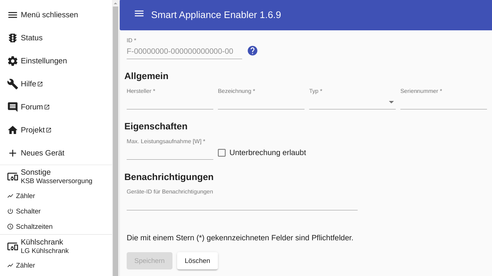
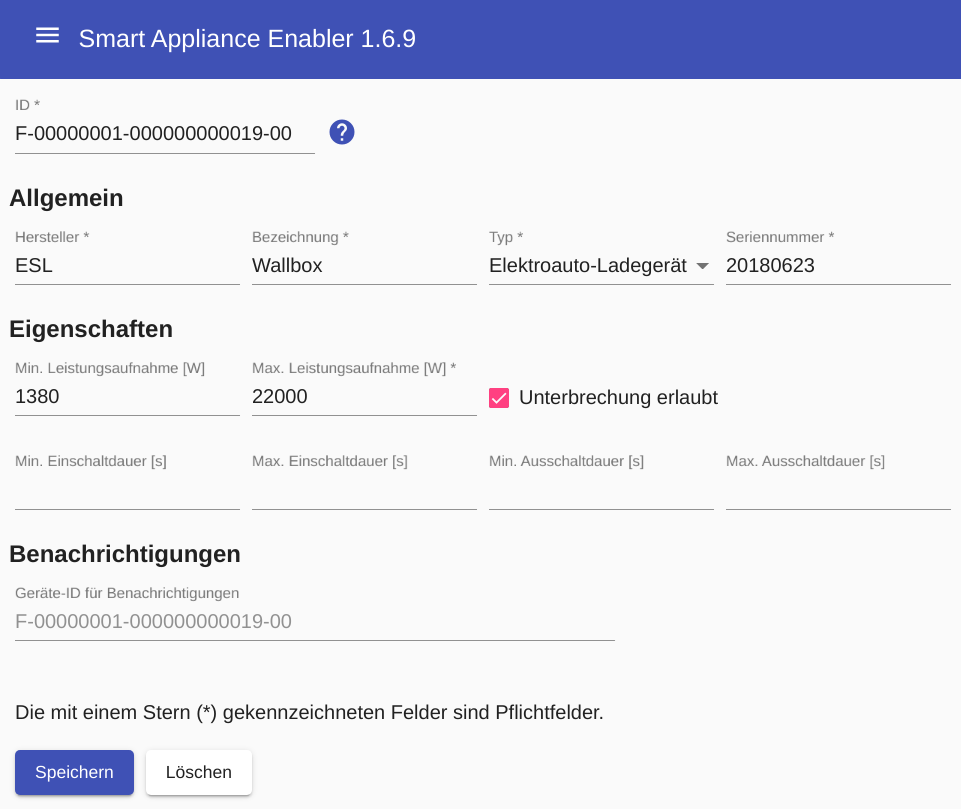

# Gerät

Durch Klick auf `Neues Gerät` wird die Konfiguration eines neuen Geräte begonnen und es öffnet sich folgende Seite:

Nach dem Speichern des Geätes erscheint im Menü ein Eintrag für das angelegte Gerät. Zusätzlich erscheinen die Unterpunkte Zähler, Schalter und Schaltzeiten.

Durch Klicken der `Löschen`-Schaltfläche und Bestätigung der Löschabsicht wird das Gerät gelöscht.

## Felder

### ID
Ein sehr wichtiges Attribut der Gerätekonfiguration ist die `ID`. Der Aufbau der Device-ID ist in der SEMP-Spezifikation vorgegeben und **muss über alle von SMA verwalteten *Sunny Home Manager* hinweg eindeutig sein!!** 

Für den *Smart Appliance Enabler* bedeutet das:
* F unverändert lassen ("local scope")
* 00000001 ersetzen durch einen 8-stelligen Wert, der den eigenen Bereich definiert (in der Hoffnung, damit eine eindeutige ID zu erreichen - siehe oben), z.B. das Geburtsdatum in der Form 25021964 für den 25. Februar 1964
* 000000000001 für jedes verwaltete Gerät hochzählen bzw. eine individuelle 12-stellige Zahl verwenden
* 00 unverändert lassen (sub device id)
  Die Device-IDs werden vom Sunny-Portal direkt verwendet, d.h. wenn jemand anderes bereits diese ID verwendet, kann das Gerät nicht im Sunny-Portal angelegt werden. Durch die Verwendung individueller Bestandteile wie Geburtsdatum sollte das Risiko dafür jedoch gering sein.

Das Ändern der `ID` führt dazu, dass der *Sunny Home Manager* das Gerät als Neugerät betrachtet.

### Hersteller

Der Werrt für Hersteller (z.B. `Bosch`) wird lediglich für die Anzeige im *Smart Appliance Enabler* und im *Sunny Portal* verwendet.

### Bezeichnung

Der Werrt für Bezeichnung (z.B. `SMI12345XV3`) wird lediglich für die Anzeige im *Smart Appliance Enabler* und im *Sunny Portal* verwendet.

### Typ
Der `Typ` ist ebenfalls ein zentrales Merkmal eines Gerätes.

Um ein Gerät als Wallbox konfigurieren zu können, muss hier `Elektroauto-Ladegerät` eingestellt werden.

### Seriennummer

### Min. Leistungsaufnahme

Dieses Feld wird nur angezeigt bei Geräten mit steuerbarer Leistungsaufnahme (z.B. Wallboxen).

Die vom *Sunny Home Manager* empfohlene Leistungsaufnahme wird diesen Wert nicht unterschreiten, falls angegeben.

### Max. Leistungsaufnahme

Bei Geräten, deren Leistungsaufnahme nicht steuerbar ist, die maximale Leistungsaufnahme laut Typenschild. Bei Geräten mit steuerbarer Leistungsaufnahme wird die empfohlene Leistungsaufnahme diesen Wert nicht überschreiten.

### Unterbrechnung erlaubt

Wenn aktiviert, darf der *Sunny Home Manager* die Laufzeit des Gerätes unterbrechen als Reaktion auf unvorhergesehene Energiebedarfe anderer Geräte oder schlechte Wetterbedinungen.

#### Min. Einschaltdauer

Dieses Feld ist nur aktiv, wenn `Unterbrechnung erlaubt` aktiviert wurde.

Wenn das Gerät eingeschaltet ist, muss der *Sunny Home Manager* es in diesem Zustand lassen für die angegebene Dauer.

#### Max. Einschaltdauer

Dieses Feld ist nur aktiv, wenn `Unterbrechnung erlaubt` aktiviert wurde.

Wenn das Gerät eingeschaltet ist, darf der *Sunny Home Manager* es in diesem Zustand nicht länger als die angegebene Dauer lassen.

#### Min. Ausschaltdauer

Dieses Feld ist nur aktiv, wenn `Unterbrechnung erlaubt` aktiviert wurde.

Wenn das Gerät ausgeschaltet ist, muss der *Sunny Home Manager* es in diesem Zustand lassen für die angegebene Dauer.

#### Max. Ausschaltdauer

Dieses Feld ist nur aktiv, wenn `Unterbrechnung erlaubt` aktiviert wurde.

Wenn das Gerät ausgeschaltet ist, darf der *Sunny Home Manager* es in diesem Zustand nicht länger als die angegebene Dauer lassen.

### Geräte-ID für Benachrichtigungen

Der Wert dieses Feldes wird beim Versenden von Benachrichtigungen als Absender verwendet. Wenn kein Wert eingetragen ist, wird stattdessen der Wert des Feldes `ID` verwendet. 

## Beispiel
Die Eingabe für Minimal müssen für ein Gerät folgende Angaben gemacht werden:

