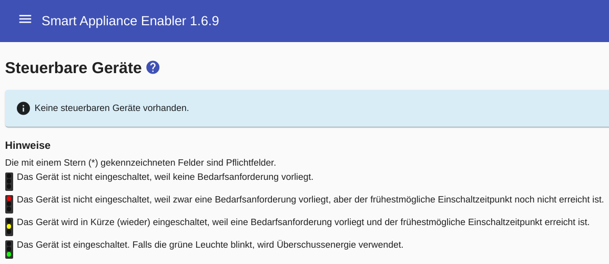
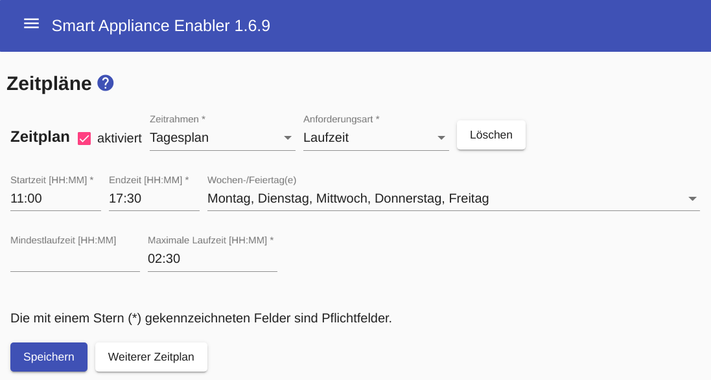
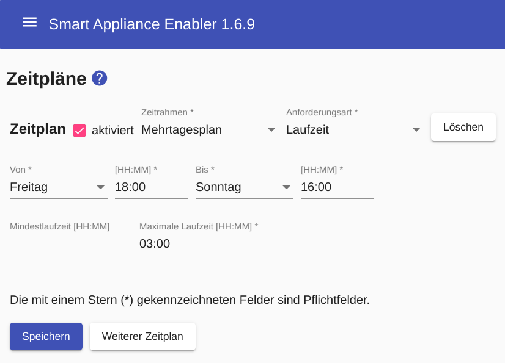

# Konfiguration

Die Konfiguration erfolgt über das Web-Frontend des *Smart Appliance Enabler*. Dazu muss man im Web-Browser lediglich eingeben ```http://raspi:8080/```, wobei *raspi* durch den Hostnamen oder die IP-Adresse des Raspberry Pi ersetzt werden muss. Es öffnet sich die Status-Seite mit dem Hinweis, dass noch keine Geräte konfiguert sind.

Die Web-Oberfläche ist bewusst einfach und dennoch komfortabel gehalten, um Browser auf PC, Tablett und Handy gleichermaßen zu unterstützen.

Grundsätzlich gilt, dass Eingaben/Änderungen erst nach dem Klicken der ```Speichern```-Schaltfläche gespeichert sind. Beim Wechsel auf ein andere Seite erfolgt eine Warnung, wenn nicht gespeicherte Eingaben/Änderungen vorhanden sind. Werden bei Eingabefeldern Inhalte mit grauer Schrift angezeigt, so handelt es sich um Voreinstellungen, d.h. wenn kein Wert eingegeben wird, gilt dieser Wert.

Beim Speichern werden die Daten in zwei [XML](https://de.wikipedia.org/wiki/Extensible_Markup_Language)-Dateien geschrieben, die sich in dem Verzeichnis befinden, auf das die Variable SAE_HOME verweist (normalerweise ```/opt/sae```):
* die Datei `Device2EM.xml` enthält Gerätebeschreibung für den EnergyManager
* die Datei `Appliances.xml` enthält die Gerätekonfiguration für den *Smart Appliance Enabler*
Die Groß-/Kleinschreibung der Dateinamen muss genau so sein, wie hier angegeben!

Beim Speichern wird außerdem der *Smart Appliance Enabler* intern neu gestartet, damit die geänderte Konfiguration wirksam wird. Aktuell laufende Geräte werden in diesem Moment immer gestoppt/ausgeschalten um einen definierten Zustand zu erhalten. Auch werden bereits in Anspruch genommene Energiemengen/Laufzeiten von Geräten zurück gesetzt und neu eingeplant.
Ist dies nicht gewünscht, empfiehlt es sich Konfigurationsänderungen außerhalb der üblichen Zeitfenster vorzunehmen, zB Abends.

Beim ersten Start ohne vorhandene Konfigurationsdateien wird folgende Seite angezeigt:



Im oberen Bereich der Seite findet sich der Menüpunkt zur Verwaltung der zentralen [Einstellungen](Settings_DE.md).

Das Seitenmenü zur Konfiguration der Geräte, Zähler, Schalter und Schaltzeiten ist nicht sichtbar und muss durch Klick auf ```Geräte``` geöffnet werden. Jetzt sieht die Seite wie folgt aus:


Durch Klick auf ```Neues Gerät``` wird die Konfiguration eines neuen Geräte begonnen und es öffnet sich folgende Seite:


## Gerätekonfiguration

Ein sehr wichtiges Attribut der Gerätekonfiguration ist die ```ID```. Der Aufbau der Device-ID ist in der SEMP-Spezifikation vorgegeben. Für den *Smart Appliance Enabler* bedeutet das:
* F unverändert lassen ("local scope")
* 00000001 ersetzen durch einen 8-stelligen Wert, der den eigenen Bereich definiert, z.B. das Geburtsdatum in der Form 25021964 für den 25. Februar 1964
* 000000000001 für jedes verwaltete Gerät hochzählen bzw. eine individuelle 12-stellige Zahl verwenden
* 00 unverändert lassen (sub device id)
Die Device-IDs werden vom Sunny-Portal direkt verwendet, d.h. wenn jemand anderes bereits diese ID verwendet, kann das Gerät nicht im Sunny-Portal angelegt werden. Durch die Verwendung individueller Bestandteile wie Geburtsdatum sollte das Risiko dafür jedoch gering sein.

Außer der Device-ID müssen allgemeine Angaben und Eigenschaften des Gerätes eingegeben werden. Wenn alle erforderlichen Eingaben erfolgt sind, wird die ```Speichern```-Schaltfläche freigegeben. Erst nach dem Drücken dieser Schaltfläche erscheinen im Seitenmenü die Unterpunkte ```Zähler``` und ```Schalter```.

Die Konfiguration eines gespeicherten Gerätes kann man durch auf den Geräte-Typ und -Namen im Seitenmenü ansehen und ändern.


Das Ändern der ```ID``` führt alledings dazu, dass der SHM das Gerät als Neugerät betrachtet.

Sobald Änderungen vorgenommen wurden und die Korrektheit der Eingaben überprüft wurde, wird wiederum die ```Speichern```-Schaltfläche freigegeben und die Änderungen können gespeichert werden. Außerdem kann das Gerät durch Klicken der ```Löschen```-Schaltfläche gelöscht werden.

## Zähler

Um einen Zähler zu konfigurieren muss in der ```Typ```-Auswahlbox der Typ des Zählers ausgewählt werden. Entsprechend dieser Auswahl werden die für den gewählten Zähler-Typ konfigurierbaren Felder eingeblendet.

Derzeit unterstützt der *Smart Appliance Enabler* Zähler mit folgenden Protokollen:

* [S0](SOMeter_DE.md)
* [Modbus](ModbusMeter_DE.md)
* [HTTP](HttpMeter_DE.md)

Nachdem alle erforderlichen Eingaben erfolgt sind, wird die ```Speichern```-Schaltfläche freigegeben.

## Schalter

Um einen Schalter zu konfigurieren muss in der ```Typ```-Auswahlbox der Typ des Schalters ausgewählt werden. Entsprechend dieser Auswahl werden die für den gewählten Schalter-Typ konfigurierbaren Felder eingeblendet.
Falls der gewählte Schalter-Typ mit [Anlaufstromerkennung](Anlaufstromerkennung_DE.md) kombiniert werden kann und diese durch Anklicken der Checkbox aktiviert wurde, werden weitere Felder mit Konfigurationsparametern der Anlaufstromerkennung eingeblendet.

Derzeit unterstützt der *Smart Appliance Enabler* Schalter mit folgenden Protokollen:

* [GPIO](GPIOSwitch_DE.md)
* [Modbus](ModbusSwitch_DE.md)
* [HTTP](HttpSwitch_DE.md)

Ein besonderer Schalter-Typ ist ```Immer eingeschaltet```. Dieser eignet sich für Geräte, die immer eingeschaltet sind (z.B. Kühlschrank) und bei denen lediglich der Verbrauch überwacht werden soll. Die Konfiguration dieses Schalters ist erforderlich, weil nur Verbräuche eingeschalteter Geräte berücksichtigt werden.

Nachdem alle erforderlichen Eingaben erfolgt sind, wird die ```Speichern```-Schaltfläche freigegeben. Falls ein Schalter konfiguriert wurden, erscheint nach dem Drücken dieser Schaltfläche erscheinen im Seitenmenü der Unterpunkt ```Schaltzeiten```.

Wenn als Gerätetyp ```Elektroauto-Ladegerät``` angegeben ist, kann auf dieser Seite die [Konfiguration des Lade-Controllers sowie die Verwaltung der Fahrzeuge](EVCharger_DE.md) vorgenommen werden.

## Zeitpläne

Wenn ein Gerät schaltbar ist, können Zeitpläne konfiguriert werden. Ein Zeitplan hat einen Zeitrahmen, auf den er sich bezieht. Das kann entweder ein ```Tagesplan``` (bezieht sich auf Kalendertag) oder ein ```Mehrtagesplan``` (dauert länger als 24 Stunden aber höchstens eine Woche) sein.

Für einen Tagesplan kann angegeben werden, dass dieser an Feiertagen gelten soll.
Diese hat Vorrang vor anderen Tagesplänen, die entsprechend des Wochentages gelten würden. Voraussetzung dafür ist, dass das [Feiertagshandling in der Konfiguration aktiviert](Settings_DE.md#Feiertage) wurde.

Neben dem Zeitrahmen hat ein Zeitplan auch eine `Anforderungsart`, die (abhängig vom Geräte-Typ) meist `Laufzeit` ist. Dabei wird über die `Startzeit` und die `Endzeit` ein Zeitfenster definiert, innerhalb dessen der SHM die `maximale Laufzeit` sicherstellen muss. Wird zusätzlich die (optionale) `minimale Laufzeit` angegeben, wird der SHM nur diese Laufzeit sicherstellen, aber bei Vorhandensein von *Überschussenenergie* die Laufzeit bis zur `maximalen Laufzeit` erweitern. Im Extremfall führt das Setzen einer `minimalen Laufzeit` von 0 dazu, dass das Gerät ausschliesslich mit Überschussenergie betrieben wird. Wenn diese nicht vorhanden ist, wird das Gerät nicht eingeschaltet.


Schaltzeiten mit Tagesplan


Schaltzeiten mit Mehrtagesplan

Der *Smart Appliance Enabler* meldet dem Sunny Home Manager den Geräte-Laufzeitbedarf für die nächsten 48 Stunden, damit er auf dieser Basis optimal planen kann.

# Konfiguration mittels XML-Dateien

## Vorgehensweise

Die XML-Dateien kann man entweder auf dem Raspberry Pi bearbeiten oder man transferiert sie dazu auf den PC. Letzteres bietete sich insbesondere für größere Änderungen an, nach denen noch eine Überprüfung der Inhalte auf Gültigkeit erfolgen soll (siehe unten). Zum Transferieren der Dateien zwischen Raspberry Pi und PC kann man unter Linux ```scp``` verwenden, unter Windows gibt es ```WinSCP``` ([Video mit WinSCP Anleitung auf Deutsch](https://www.youtube.com/watch?v=z6yJDMjTdMg)).

## Überprüfung der Dateien
Die angepassten XML-Dateien sollten hinsichtlich ihrer Gültigkeit überprüft werden.
Dazu ist die Seite http://www.freeformatter.com/xml-validator-xsd.html besonders geeignet:
Der Inhalt der XML-Datei wird in das Fenster *XML Input* kopiert. 
In das Fenster *XSD Input* muss der Inhalt (nicht die URL selbst!) der nachfolgenden URL kopiert werden:
* beim Prüfen von Device2EM.xml: https://raw.githubusercontent.com/camueller/SmartApplianceEnabler/master/xsd/SEMP-1.1.5.xsd
* beim Prüfen von Appliances.xml: https://raw.githubusercontent.com/camueller/SmartApplianceEnabler/master/xsd/SmartApplianceEnabler-1.4.xsd

Ist die Prüfung erfolgreich, erscheint oberhalb des *XML Input* eine grün unterlegte Meldung *The XML document is valid.*. Bei Fehlern erscheint eine rot unterlegte Meldung mit entsprechender Fehlerbeschreibung.

## Konfiguration mittels REST
Für die Konfiguration mittels Web-Frontend existieren entsprechende REST-Services. Diese können, wie die SEMP-Schnittstelle selbst, auch unabhängig vom Web-Frontend verwendet werden.

### Schalten eines Gerätes
Zum Einschalten eines Gerätes kann folgender Befehl verwendet werden, wobei die URL un die Device-ID (identisch mit Appliance-ID) anzupassen ist:
```console
curl -X POST -d '<EM2Device xmlns="http://www.sma.de/communication/schema/SEMP/v1"><DeviceControl><DeviceId>F-00000001-000000000002-00</DeviceId><On>true</On></DeviceControl></EM2Device>' --header 'Content-Type: application/xml' http://127.0.0.1:8080/semp
```
Zum Ausschalten muss lediglich ```<On>false</On>``` statt ```<On>true</On>``` gesetzt werden.

Ein Gerät, das manuell eingeschaltet wird bleibt nur dann in diesem Zustand wenn es sich in einem aktiven Timeframe befindet. Andernfalls schaltet es der SAE wieder aus.
Um vor dem Einschalten zusätzlich einen Timeframe für eine bestimmte Laufzeit zu erzeugen ist ein zweiter Befehl notwendig. Beide Befehle direkt hintereinander abgesetzt (zuerst Timeframe, dann Einschalten) bewirken das selbe was die Ampelfunktion zur Verfügung stellt (Klick für sofortigen Start + Auswahl der entsprechenden Laufzeit).
Zum aktivieren eines zusätzlichen Timeframe für 10 Minuten ab sofort funktioniert folgender Befehl:
```console
curl -s -X PUT -F id=F-00000001-000000000002-00 -F runtime=600 http://127.0.0.1:8080/sae/runtime
```

### Setzen der Schedules
Normalerweise werden die Schedules aus der Datei `Appliance.xml` gelesen. Es ist jedoch möglich, die Schedules via REST an den SAE zu übergeben. Dazu müssen der/die Schedules in einem Root-Element `Schedules` zusammengefasst werden, das an SAE unter Angabe der Appliance-ID übergeben wird:
```console
curl -s -X POST -d '<Schedules xmlns="http://github.com/camueller/SmartApplianceEnabler/v1.4"><Schedule><RuntimeRequest min="1800" max="3600" /><DayTimeframe><Start hour="0" minute="0" second="0" /><End hour="18" minute="59" second="59" /></DayTimeframe></Schedule></Schedules>' --header 'Content-Type: application/xml' http://localhost:8080/sae/schedules?id=F-00000001-000000000001-00
```
Das ```xmlns```-Attribut (insbesondere die Version des *Smart Appliance Enabler* am Ende) muss dabei übereinstimmen mit dem ```xmlns```-Attribut in der Datei ```Appliances.xml```. 

Im Log des SAE sollte sich danach folgendes finden:
```console
2020-01-12 18:31:10,606 DEBUG [http-nio-8080-exec-3] d.a.s.w.SaeController [SaeController.java:413] F-00000001-000000000099-00: Received request to activate 1 schedule(s)
2020-01-12 18:31:10,614 DEBUG [http-nio-8080-exec-3] d.a.s.a.RunningTimeMonitor [RunningTimeMonitor.java:82] F-00000001-000000000099-00: Using enabled time frame 00:00:00.000-18:59:59.000/1800s/3600s
```
