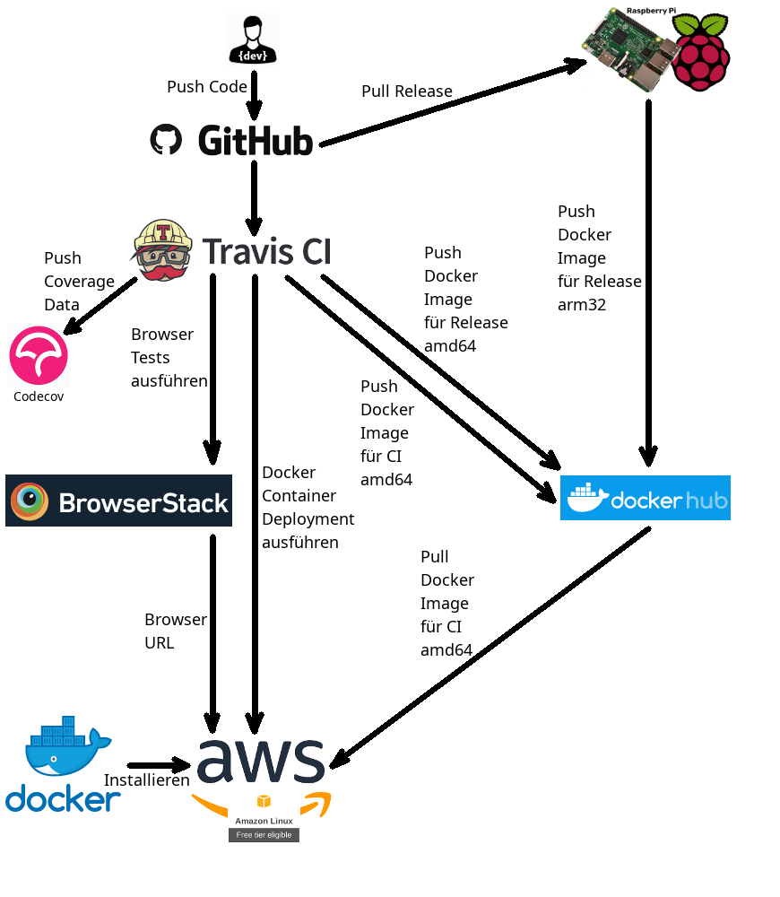

# Entwicklung
## Art der Anwendung
Beim *Smart Appliance Enabler* handelt es sich um eine [Spring Boot](http://projects.spring.io/spring-boot) -Anwendung mit einer [Angular](https://angular.io) -Web-Anwendung. 

## Continuous Integration (CI)
Für den *Smart Appliance Enabler* existiert eine [Continuous Integration](https://de.wikipedia.org/wiki/Kontinuierliche_Integration) -Umgebung, in der die Anwendung vollständig automatisiert gebaut und getestet wird:



Sobald Änderungen am [*Smart Appliance Enabler*-Github-Repository](https://github.com/camueller/SmartApplianceEnabler) erkannt werden, wird dies an [Travis-CI](https://travis-ci.org/camueller/SmartApplianceEnabler) signalisiert. Daraufhin wird dort eine virtuelle Umgebung gestartet, in welcher der *Smart Appliance Enabler* gebaut wird. Dabei werden auch die Unit-Tests ausgeführt, wobei Daten über die Testabdeckung gewonnen werden. Diese Coverage-Daten werden zu [codecov](https://codecov.io/gh/camueller/SmartApplianceEnabler) gepusht, wo sie visualisiert werden. Als Build-Artefakt entsteht die Datei **SmartApplianceEnabler.war**, die sich in einer **Java-Runtime** starten läßt. Um die Installation (Java, Konfigurationsdateien, ...) zu vereinfachen, wird ein **Docker-Image** speziell für CI erstellt, das den *Smart Appliance Enabler* mit allen benötigten Dateien inlusive Java-Runtime enthält. Wegen der Platformabhängigkeit der Java-Runtime ist das Docker-Image nur auf Prozessoren mit **amd64**-Architektur lauffähig (also nicht auf Raspberry Pi!). Das Docker-Image wird zu [Docker-Hub](https://hub.docker.com/) gepusht.

In der [AWS](https://aws.amazon.com/de/) -Cloud läuft eine [EC2](https://aws.amazon.com/de/ec2/) -Instanz mit Amazon Linux darauf. Als einzige Software wurde Docker installiert. Im Rahmen des Build-Vorgangs auf *Travis-CI* wird ein Shell-Script auf der EC2-Instanz ausgeführt, welches das *Smart Appliance Enabler*-Docker-Image für CI von *Docker-Hub* pullt und einen Container damit startet. Dadurch gibt es einen laufenden *Smart Appliance Enabler*, der vom Internet aus zugreifbar ist und für Tests zur Verfügung steht. 

Um die Funktionalität insgesamt (d.h. Web-Anwendung und Spring Boot-Anwendung) zu testen, wird über Web-Browser eine neue Konfiguration erstellt. Diese Tests werden mittels [BrowserStack](https://www.browserstack.com/) mit verschieden Web-Browsern auf unterschiedlichen Betriebssystemen ausgeführt.

Für den Betrieb des *Smart Appliance Enabler* als Docker-Container auf einem *Raspberry Pi* muss für jedes Release (nicht für jeden Push zu Github!) ein Docker-Image mit einer Java-Runtime für **arm32**-Architektur erstellt werden. Was liegt näher, als diese Aufgabe von einem meiner Raspberry Pi's automatisch erledigen zu lassen. Auch dieses Image wird zu [Docker-Hub](https://hub.docker.com/) gepusht. 

## Lokales Entwickeln
### Source-Download
Für alle nachfolgenden Schritte müssen die Sourcen lokal vorhanden sein.
Am einfachsten verwendet man einen Git-Client ([Git installieren](https://git-scm.com/book/de/v1/Los-geht%E2%80%99s-Git-installieren)) zum Klonen des Repositories:
```console
git clone https://github.com/camueller/SmartApplianceEnabler.git
```

Notfalls kann man die Sourcen auch als [ZIP-Datei](https://github.com/camueller/SmartApplianceEnabler/archive/master.zip) herunterladen. Letzteres muß natürlich erst noch ausgepackt werden.

### Bauen

Zum Bauen ist das Build-Tool [Maven](https://maven.apache.org) erforderlich, das gegebenenfalls noch [installiert](https://maven.apache.org/install.html) werden muss.

Um den *Smart Appliance Enabler* ohne Web-Oberfläche zu bauen, ruft man Maven im Verzeichnis *SmartApplianceEnabler* wie folgt auf:
```console
mvn clean package
```

Soll der *Smart Appliance Enabler* mit Web-Oberfläche gebaut werden, muss das Maven-Profil `web` aktiviert werden:
```console
mvn clean package -Pweb
```

Beim erstmaligen Aufruf von Maven werden dabei alle benötigten Bibliotheken aus dem offiziellen Maven-Repository heruntergeladen. Das Bauen war nur dann erfolgreich, wenn *BUILD SUCCESS* erscheint! In diesem Fall findet sich die Datei `SmartApplianceEnabler-*.war` im Unterverzeichnis `target`.

### Starten


#### UPnP Deaktivierung
In der Regel ist es nicht erwünscht, dass der Sunny Home Manager (SHM) die für die Entwicklung verwendete SAE-Instanz (in der IDE oder auf einem Entwicklungs-Raspi) per UPnP "entdeckt" und die Geräte übernimmt.
Deshalb kann das UPnP des SAE mit einem Property deaktiviert werden:
```console
-Dsae.discovery.disable=true
```

### Tests
#### Testcafe
Zum Ausführen von Testcafe-Tests in WebStorm sollte folgendes Plugin über den Marketplace installiert werden:
https://plugins.jetbrains.com/plugin/13133-testcafe-runner-for-webstorm/

Alternativen können die Tests in der Shell gestartet werden:
```console
axel@p51:/data/IdeaProjects/SmartApplianceEnabler/src/test/angular$ testcafe "browserstack:chrome@69.0:Windows 10" "src/appliance.spec.ts"
 Running tests in:
 - Chrome 69.0.3497.92 / Windows 10 (https://automate.browserstack.com/builds/02a07b54c04c76fb251f6d0e3621ab2823fe4421/sessions/69b381846b5b0c0918f0ebfbe5337f1ad2d37473)

 Appliance
 ✓ Create appliance


 1 passed (27s)
```

#### Browserstack
Für die Verwendung von Testcafe mit Browserstack muss ein Plugin installiert werden:
```console
npm install --save testcafe-browser-provider-browserstack
```
Weitere Infos: https://www.browserstack.com/automate/testcafe
