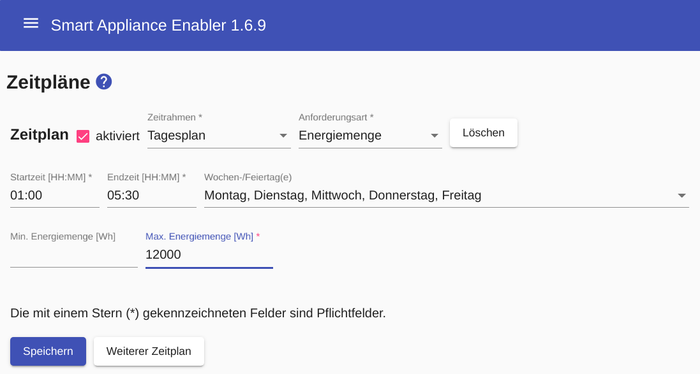
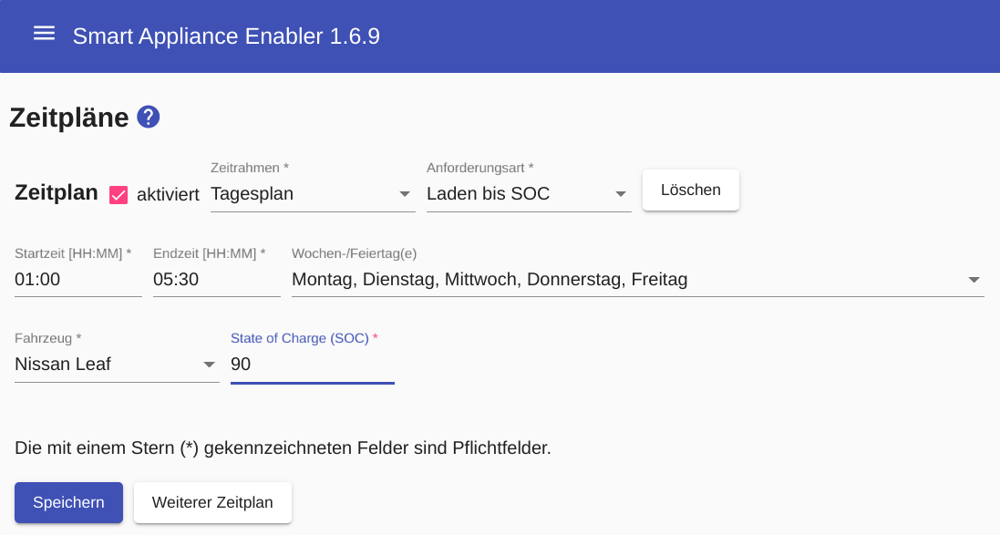

# Wallboxen

Damit der Sunny Home Manager die Leistung von Wallboxen steuern kann, **muss zur Bestimmung der aktuellen Leistungsaufnahme ein Stromzähler im Smart Appliance Enabler konfiguriert werden**!

## Konfiguration
### Appliance
Um ein Gerät als Wallbox konfigurieren zu können, muss als Typ des Gerätes ```Elektroauto-Ladegerät``` eingestellt werden.


### Schalter
Im *Smart Appliance Enabler* wird eine Wallbox als komplexer Schalter mit diversen Konfigurationsparametern und die Fahrzeuge repräsentiert.

Momentan unterstützt der *Smart Appliance Enabler* folgende Wallboxen:
* [Wallboxen mit Phoenix Contact EM-CP-PP-ETH-Controller](PhoenixContactEMCPPPETH_DE.md) wie z.B. Walli
* [go-eCharger](GoeCharger_DE.md)
* wallbe

Der *Smart Appliance Enabler* stellt Vorlagen bereit, welche die Konfiguration für die genannten Wallboxen beinhalten.
Darüber hinaus sollte auch die Verwendung von anderen Wallboxen möglich sein, solange diese über ein unterstütztes Protokoll angebunden werden:
* [Modbus/TCP](Modbus_DE.md)
* HTTP

#### Fahrzeuge
Die Konfiguration von Fahrzeugen beinhaltet Parameter zur Steuerung des Ladevorgangs und Standardwerte für Dialoge.

Für den Ziel-Ladezustand können Standardwerte festgelegt werden.
Der Standardwert für manuelles Laden beinhaltet lediglich die Vorbelegung des Feldes für den Soll-Ladezustand in der Eingabemaske, die nach Klick auf die grüne Ampelleuchte angezeigt wird.
Wird ein Standardwert für Überschussenergie gesetzt, wird nach dem Verbinden des Fahrzeugs nur bis zu diesem Wert mit Überschussenergie geladen und danach der Ladevorgang gestoppt.

Die vom *Smart Appliance Enabler* unterstützten Wechselstrom-Wallboxen können nicht den aktuellen Ist-Ladezustand vom Fahrzeug ermitteln und an den *Smart Appliance Enabler* kommunizieren! Für eine möglichst genaue Ermittlung des Energiebedarfs muss dieser Wert aber bekannt sein. Der *Smart Appliance Enabler* bietet deshalb die Möglichkeit der Einbindung eines [Scripts zum automatisierten Abfragen des SOC](soc/SOC_DE.md), sofern dies vom Fahrzeug-Hersteller unterstützt wird. Zusätzlich besteht die Möglichkeit, den Ist- und Soll-Ladezustand einzugeben beim [manuellen Start des Ladevorganges](#status-anzeige-und-manuelle-steuerung). Ohne SOC-Script und ohne Eingabe des aktuellen Ist-Ladezustands geht der *Smart Appliance Enabler* von einem Ist-Ladezustand von 0% aus und meldet einen entsprechend großen Energiebedarf. Das verschlechtert zwar die Planung des *Sunny Home Manager*, aber unabhängig davon beendet die Wallbox das Laden spätestens, wenn das Fahrzeug voll geladen ist.

Wenn vom SOC-Script nicht nur eine Zahl ohne weitere Zeichen geliefert wird, sondern der Verbrauchswert irgendwo in einem Text (XML, JSON, ...) enthalten ist, muss ein [Regulärer Ausdruck/Regex](WertExtraktion_DE.md) zum Extrahieren der Leistung mit angegeben werden.


### Zeitpläne
Die grundsätzliche Konfiguration der Zeitpläne ist [hier](Configuration_DE.md#zeitpläne) beschrieben.
Abweichend davon existieren bei Wallboxen als **Anforderungsart** zwei Optionen:

Mit der Anforderungsart ```Energiemenge``` kann eine bestimmte minimale und/oder maximale Energiemenge (in Wh) zum Ausdruck gebracht werden. Wenn die minimale Energiemenge auf ```0``` gesetzt wird und die maximale Energiemenge auf einen größeren Wert, wird damit zum Ausdruck gebracht, dass für die angeforderte Energiemenge *Überschussenenergie* genutzt soll.



Mit der Anforderungsart ```Laden bis SOC``` wird genau die Energiemenge angefordert, die notwendig ist, um einen bestimmten SOC zu erreichen. Zur Berechnung dieser Energiemenge wird die Batteriekapazität und der SOC des Fahrzeugs bei Ladebeginn herangezogen. Für letzteres ist es notwendig, dass der [SOC des Fahrzeugs via Script](soc/SOC_DE.md) abgefragt werden kann.



## Status-Anzeige und manuelle Steuerung

Für Wallboxen unterscheiden sich die Eingabe-Felder zum manuellen Schalten, die nach einem **Klick auf das grüne Ampellicht** angezeigt werden, von den Feldern, die bei anderen Geräten angezeigt werden.


Wenn ein [SOC-Script](soc/SOC_DE.md) für das ausgewählte Fahrzeug angegeben wurde, wird das Eingabefeld ```Ladezustand: Ist``` vorbelegt mit dem aktuellen Wert zu diesem Zeitpunkt. Ansonsten kann er im Auto abgelesen und eingegeben werden, wenn man dem SHM eine gute Planung ermöglichen will. Ansonsten wird 0 angenommen und ein entsprechend hoher Energiebedarf gemeldet.

Wird im Eingabefeld ```Ladezustand: Soll``` kein Wert eingegeben, wird 100% angenommen und ein entsprechend hoher Energiebedarf gemeldet.

Wenn im Eingabefeld ``bis`` ein Wochentag/Zeit eingegeben, wird dem SHM der Bedarf gemeldet aber der *Smart Appliance Enabler*, aber das Laden beginnt erst, wenn der SHM einen Einschaltbefehl mit Vorgabe der Ladeleistung sendet. Wird kein Wochentag/Zeit eingegeben, schaltet der *Smart Appliance Enabler* die Wallbox sofort ein, wobei mit voller Leistung geladen wird.

Auch die Status-Anzeige sieht bei Wallboxen anders aus. Nachfolgendes Bild zeigt einen manuell gestarteten Ladevorgang:


Für eine via Schaltzeiten anforderte Energiemenge sieht die Statusanzeige vor dem Einschalten wie folgt aus:


