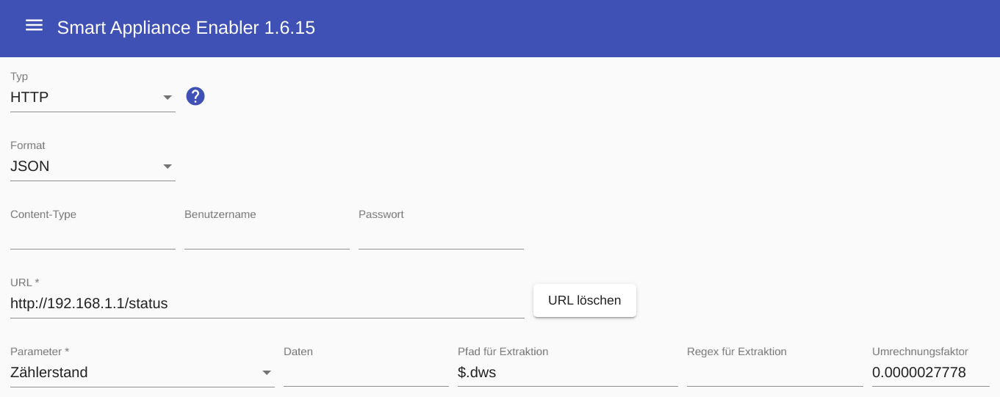

# go-eCharger

Ein sehr vielseitiges, kompaktes Ladegerät, das auch für den mobilen Einsatz geeignet ist, ist der [go-eCharger](https://go-e.co/go-echarger-home/).
Bei Verwendung des go-eCharger ist kein separater Stromzähler erforderlich, weil der Zählerwert vom go-eCharger mit hoher Genauigkeit bereitgestellt wird und der *Smart Appliance Enabler* daraus die aktuelle Leistungsaufnahme berechnet.

## Geräte-Konfiguration

Der go-eCharger muss mit WLAN verbunden sein, in dem sich auch der *Smart Appliance Enabler* befindet oder das zumindest für ihn erreichbar ist.
Die HTTP-Schnittstelle des go-eCharger muss aktiviert werden, damit der *Smart Appliance Enabler* mit ihm darüber kommunizieren kann.

## Konfiguration im Smart Appliance Enabler

### Schalter

Für die Konfiguration sollte die Vorlage `go-eCharger` verwendet werden - dadurch werden alle Felder korrekt ausgefüllt. Lediglich die IP-Adresse bzw. der Hostname in den URL-Feldern muss auf die des go-eChargers angepasst werden. 

### Zähler

Wie oben geschrieben muss der go-eCharger selbst als Zähler angegeben werden, d.h.
die IP-Adresse bzw. der Hostname in den URL-Feldern muss auf die des go-eChargers angepasst werden. 

Als `Format` muss `JSON` ausgewählt werden, damit die Antworten des go-eCharger korrekt interpretiert werden können.

Das Feld `Pfad` muss den Wert `$.dws` enthalten, damit der *Smart Appliance Enabler* weiss, an welcher Stelle in der Antwort des go-eChargers der Wert für die Energiemenge enthalten ist. 

Im Feld `Umrechnungsfaktor` muss die Zahl `0.0000027778` eingegeben werden, weil der go-eCharger die Energiemenge in 10 Deka-Watt-Sekunden liefert.

Der Zustand `Leistung` darf für den go-eCharger nicht konfiguriert werden, damit der *Smart Appliance Enabler* die aktuelle Leistung aus Energiemengendifferenz bezogen auf die Zeitdifferenz berechnet.

