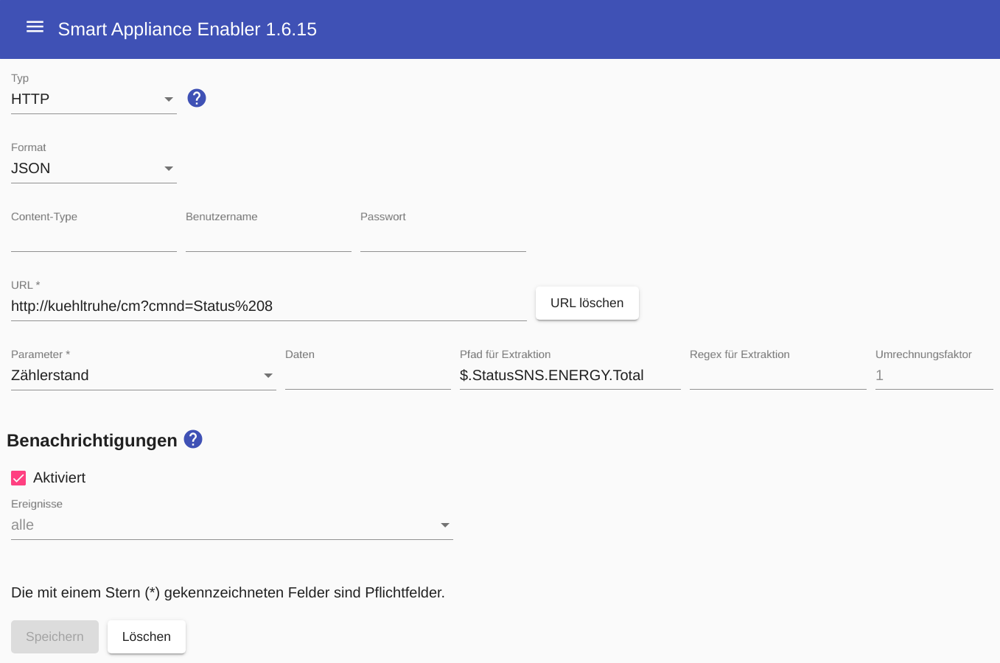

# HTTP-basierte Stromzähler

Für HTTP-basierte Stromzähler muss eine URL angegeben. Bei der Eingabe einer URL ist zu beachten, dass bei Angabe der URL bestimmte Sonderzeichen "encoded" angegeben werden müssen. Zum Beispiel muss anstatt des "&"-Zeichens der Ausruck ```"&amp;"``` (ohne Anführungszeichen) verwendet werden! Zum "encoden" von URLs kann https://coderstoolbox.net/string/#!encoding=url&action=encode&charset=us_ascii verwendet werden.

Falls erforderlich, können Benutzername und Passwort für eine __Basic Authentication__ angegeben werden.

Wenn nicht nur eine Zahl ohne weitere Zeichen für den Verbrauchswert geliefert wird, sondern der Verbrauchswert irgendwo in einem Text (XML, JSON, ...) enthalten ist, muss ein [Regulärer Ausdruck zum Extrahieren](WertExtraktion_DE.md) der Leistung mit angegeben werden. Dies gilt auch wenn die abgefragte URL nach dem Zahlenwert einen Zeilenumbruch (CR/LF) liefert, wie es häufig bei Hausautomationen wie zum Beispiel fhem der Fall ist. Hier als [Regulärer Ausdruck zum Extrahieren](WertExtraktion_DE.md)  dann einfach ```(\d+)``` angeben, um zu verhindern das in der [Log-Datei](Support.md#Log) ungewollte Zeilenumbrüche protokolliert werden.

Falls der über HTTP gelieferte Verbrauchswert nicht in Watt geliefert wird, muss ein ```Faktor zur Umrechnung in Watt``` angegeben werden, mit dem der gelieferte Wert multipliziert werden muss, um den Verbrauch in Watt zu erhalten. Wird beispielsweise der Verbrauch in mW geliefert, muss dieser Faktor mit dem Wert ```1000``` angegeben werden.

Mit dem ```Abfrage-Intervall``` kann festgelegt werden, in welchen Abständen die aktuelle Leistungsaufnahme bei der Datenquelle abgefragt wird.

Ausserdem kann ein ```Messinterval``` angegeben werden für die Durchschnittsberechnung der Leistungsaufnahme.



Wird ein Zähler über HTTP abgefragt, finden sich in der [Log-Datei](Support.md#Log) für jede Abfrage folgende Zeilen:

```
2020-04-11 17:26:52,886 DEBUG [Timer-0] d.a.s.u.GuardedTimerTask [GuardedTimerTask.java:54] F-00000001-000000000001-00: Executing timer task name=PollPowerMeter id=4892940
2020-04-11 17:26:52,886 DEBUG [Timer-0] d.a.s.h.HttpTransactionExecutor [HttpTransactionExecutor.java:105] F-00000001-000000000001-00: Sending GET request url=http://tasmota/cm?cmnd=Status%208
2020-04-11 17:26:52,935 DEBUG [Timer-0] d.a.s.h.HttpTransactionExecutor [HttpTransactionExecutor.java:160] F-00000001-000000000001-00: Response code is 200
2020-04-11 17:26:52,937 DEBUG [Timer-0] d.a.s.h.HttpHandler [HttpHandler.java:86] F-00000001-000000000001-00: url=http://tasmota/cm?cmnd=Status%208 httpMethod=GET data=null path=null
2020-04-11 17:26:52,938 DEBUG [Timer-0] d.a.s.h.HttpHandler [HttpHandler.java:89] F-00000001-000000000001-00: Response: {"StatusSNS":{"Time":"2020-04-11T16:26:50","ENERGY":{"TotalStartTime":"2020-01-05T17:01:57","Total":0.244,"Yesterday":0.002,"Today":0.013,"Power":780,"ApparentPower":813,"ReactivePower":226,"Factor":0.96,"Voltage":236,"Current":3.446}}}
2020-04-11 17:26:52,938 DEBUG [Timer-0] d.a.s.h.HttpHandler [HttpHandler.java:58] F-00000001-000000000001-00: value=780.0 protocolHandlerValue={"StatusSNS":{"Time":"2020-04-11T16:26:50","ENERGY":{"TotalStartTime":"2020-01-05T17:01:57","Total":0.244,"Yesterday":0.002,"Today":0.013,"Power":780,"ApparentPower":813,"ReactivePower":226,"Factor":0.96,"Voltage":236,"Current":3.446}}} valueExtractionRegex=,.Power.:(\d+) extractedValue=780
2020-04-11 17:26:52,939 DEBUG [Timer-0] d.a.s.u.TimestampBasedCache [TimestampBasedCache.java:62] F-00000001-000000000001-00: cache=Power added value=780.0 timestamp=2020-04-11T17:26:52.886886  removed/total: 1/7
```
