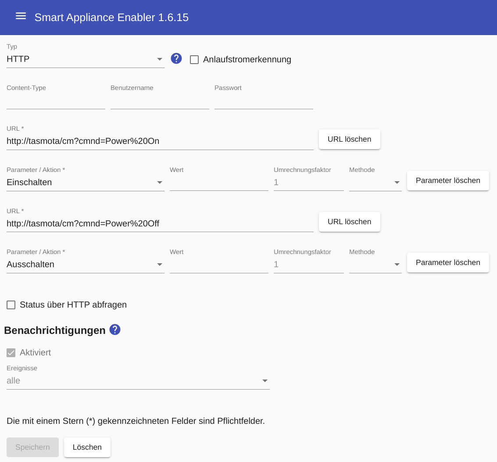

# HTTP-basierte Schalter

Für HTTP-basierte Schalter kann eine URL zum Einschalten und eine weitere URL zum Ausschalten angegeben werden.

Optional kann eine weitere URL angegeben werden, die zur Bestimmung des Schaltzustandes abgefragt wird. Das kann notwendig sein, wenn das Gerät nicht nur über den *Smart Appliance Enabler* gesteuert wird. Dabei muss ein [Regulärer Ausdruck](WertExtraktion_DE.md) angegeben werden, der "matchen" muss, wenn der Schaltzustand "eingeschaltet" ist. Liefert dieser besipielsweise "true" (ohne Anführungszeichen), so muss als Regulärer Ausdruck "(true)" (ohne Anführungszeichen) eingetragen werden.

Für alle URLs lassen sich Daten angeben, die mit der Anfrage gesendet werden. Wenn Daten angegeben werden, sollte auch der Content-Type dieser Daten in dem entsprechenden Eingabefeld angegeben werden.

Falls erforderlich, können Benutzername und Passwort für eine __Basic Authentication__ angegeben werden.

Bei der Eingabe einer URL ist zu beachten, dass bei Angabe der URL bestimmte Sonderzeichen "encoded" angegeben werden müssen. Zum Beispiel muss anstatt des "&"-Zeichens der Ausruck ```"&amp;"``` (ohne Anführungszeichen) verwendet werden! Zum "encoden" von URLs kann https://coderstoolbox.net/string/#!encoding=url&action=encode&charset=us_ascii verwendet werden.



Wird ein Gerät über HTTP geschaltet, finden sich in der [Log-Datei](Support.md#Log) für jeden Schaltvorgang folgende Zeilen:
```
2020-04-11 17:26:03,735 DEBUG [http-nio-8080-exec-1] d.a.s.s.w.SempController [SempController.java:219] F-00000001-000000000001-00: Received control request: on=true
2020-04-11 17:26:03,737 DEBUG [http-nio-8080-exec-1] d.a.s.a.Appliance [Appliance.java:332] F-00000001-000000000001-00: Setting appliance state to ON
2020-04-11 17:26:03,737 INFO [http-nio-8080-exec-1] d.a.s.c.HttpSwitch [HttpSwitch.java:127] F-00000001-000000000001-00: Switching on
2020-04-11 17:26:03,737 DEBUG [http-nio-8080-exec-1] d.a.s.h.HttpTransactionExecutor [HttpTransactionExecutor.java:105] F-00000001-000000000001-00: Sending GET request url=http://tasmota/cm?cmnd=Power%20On
2020-04-11 17:26:03,849 DEBUG [http-nio-8080-exec-1] d.a.s.h.HttpTransactionExecutor [HttpTransactionExecutor.java:160] F-00000001-000000000001-00: Response code is 200
```
