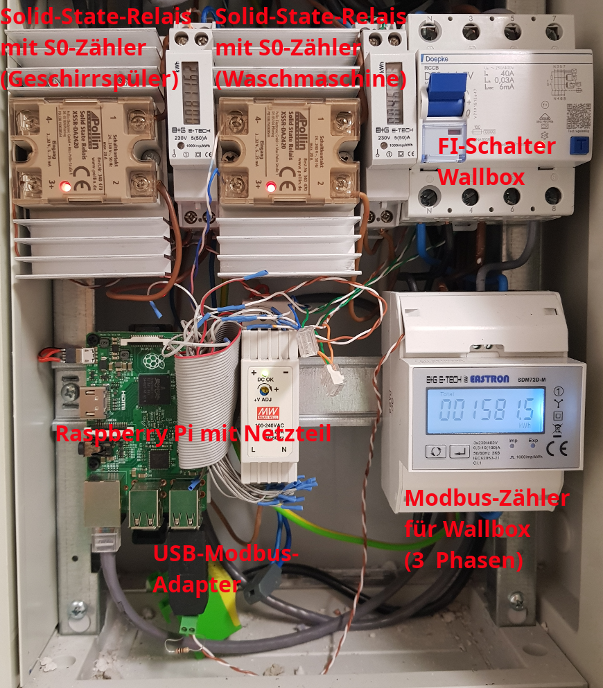
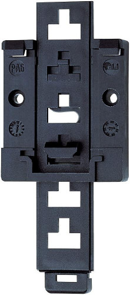
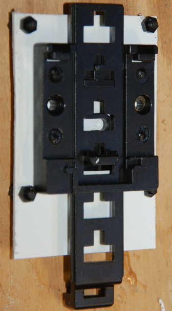
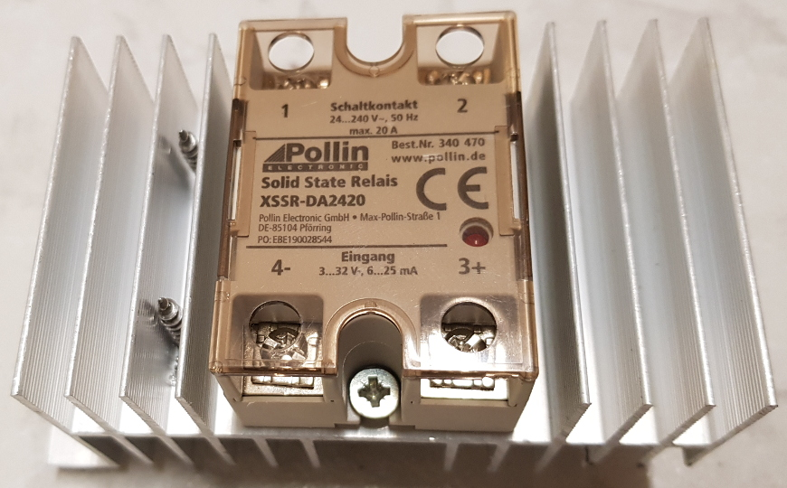

# Montage

*Hinweis: Die Installation von steckerlosen 200/400V-Geräten sollte grundsätzlich durch einen autorisierten Fachbetrieb vorgenommen werden!*

Eine Möglichkeit der Montage des Raspberry Pi besteht darin, ihn direkt im Verteilerschrank zu platzieren. Das bietet sich insbesondere dann an, wenn **Digitalstromzähler** mit S0 oder Modbus-Ausgang und/oder **Solid State Relais** verwendet werden, die ebenfalls dort montiert sind.
Für die Stromversorgung des Raspberry Pi muss dann ein **Netzteil** montiert werden.
Zum Verbinden der Digitalstromzähler und Solid State Relais mit dem Raspberry Pi eignet sich ein **IDE-Flachkabel** aus einem alten PC.
Im Ergebnis könnten die montierten Geräte so aussehen:

## DIN-Schienenhalter

Zur Montage von Raspberry Pi und Solid-State-Relais im Schaltschrank verwende ich DIN-Schienenhalten vom Typ **Bopla TSH 35**, die man bei den großen Elektronikhändlern bestellen kann. Auf diese Schraube ich zunächst eine PVC-Platte auf. Auf dieser wird dann das eigentliche Bauteil mit Nylonschrauben (leiten keinen Strom) befestigt.

## Solid State Relais (SSR)
Ursprünglich hatte ich mehrere SSRs von Fotek, Typ SSR-40 DA, gekauft, zwei davon (Geschirrspüler und Waschmaschine) musste ich nach 3 Jahren ersetzen, nachdem diese durchgeschmort waren. Diese SSRs haben auf der Rückseite eine Metallplatte, mit der man sie auf einen Kühlkürper montieren kann, was ich allerdings nicht getan hatte. Von den gekaufen SSRs waren einige von Anfang an defekt und nach kürzlich die beiden SSRs durchgeschmort waren, habe ich etwas recheriert. Von den Fotek-SSRs scheinen wohl [Fälschungen im Umlauf zu sein](https://www.mikrocontroller.net/topic/444199), die nur mit geringeren Stromstärken klarkommen als angegeben.

Aus diesem Grund habe mehrere [XSSR-DA2420 vom deutschen Electronic-Händler Pollin](https://www.pollin.de/p/solid-state-relais-xssr-da2420-3-32-v-20-a-240-v-340470) gekauft, der diese für sich produzieren und labeln lässt. Demtentsprechend hoffe ich darauf, dass es sich um ein Produkt handelt, dessen Qualität der angegebenen Spezifikation entspricht.

Um das Risiko einer Überhitzung zu minimieren habe ich gleich [passende Kühlkörper bei Pollin bestellt](https://www.pollin.de/p/strangkuehlkoerper-kab-60-125-50-430152). Hinsichtlich der Montage kam ich etwas ins Grübeln, wie ich den Kühlkörper auf dem oben erwähnten DIN-Schienenhalte vom Typ **Bopla TSH 35** befestigen kann. Letzlich habe ich es gemacht, wie auf den Fotos zu sehen, wobei ich drei Kühlrippen etwas kürzen musste.

 SSR mit Kühlkörper

 SSR mit Kühlkörper auf DIN-Schienenhalter von der Seite

 SSR mit Kühlkörper auf DIN-Schienenhalter von Rückseite
