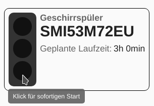
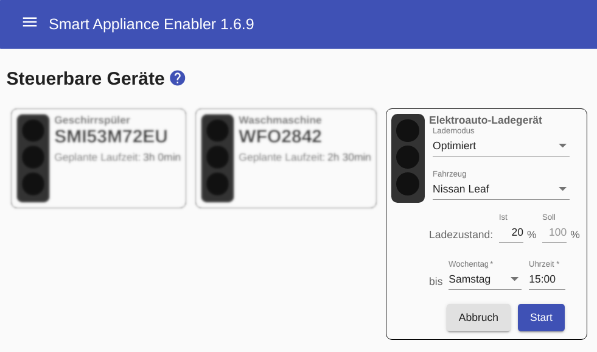
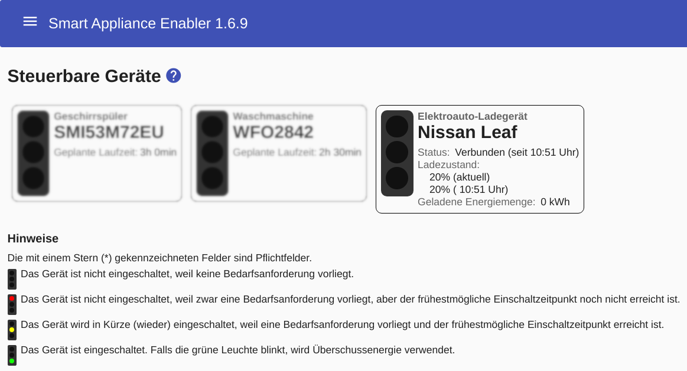
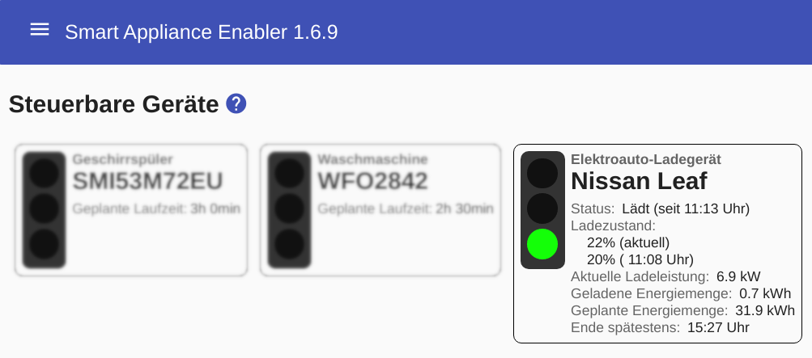

# Status

## Anzeige

Beim Öffnen der Web-Anwendung oder durch Klick auf den Menüpunkt `Status` gelangt man auf die Statusseite.

Die Statusseite zeigt den Status jedes schaltbaren Gerätes in Form einer **Ampel**, damit man den Status sofort erkennen kann:

Bei Geräten mit aktivierter [Anlaufstromerkennung](Anlaufstromerkennung_DE.md) geht die Ampel abhängig vom Zeitplan und der aktuellen Uhrzeit auf rot oder gelb, sobald der Anlaufstrom erkannt wurde.  

## Manuelles Schalten
<a name="click-green">

Die Ampel auch zum **manuellen Schalten** von Geräten. Durch einen **Klick auf die grüne Lampe** kann das Gerät unabhängig von konfigurierten Zeitplänen sofort eingeschaltet werden:

Ein Klick auf die rote Lampe bewirkt das Ausschalten des Gerätes, wobei auch das Wiedereinschalten durch den *Sunny Home Manager* für den aktiven Timeframe-Interval unterbunden wird.

Damit der *Smart Appliance Enabler* dem *Sunny Home Manager* die geplante Laufzeit mitteilen kann, muss diese eingeben werden. Falls für das Gerät ein Zeitplan existiert wird das Eingabefeld vorbelegt mit dessen Wert für Laufzeit.

Durch Klick auf die `Starten`-Schaltfläche wird das Gerät sofort eingeschaltet.

## Besonderheiten für Wallboxen
<a name="click-green-ev">

Nach einen **Klick auf das grüne Ampellicht** kann man den `Lademodus` für den aktuellen Ladevorgang festelegen.

In Abhängigkeit des gewählten Lademodus werden die Felder `Ladezustand: Ist` und/oder `Ladezustand: Soll` angzeigt, wobei Folgendes gilt:
- wenn ein [SOC-Script](soc/SOC_DE.md) für das ausgewählte Fahrzeug angegeben wurde, wird das Eingabefeld `Ladezustand: Ist` vorbelegt mit dem aktuellen Wert zu diesem Zeitpunkt. Ohne SOC-Script kann er im Auto abgelesen und hier eingegeben werden, wenn man dem *Sunny Home Manager* eine gute Planung ermöglichen will. Ansonsten wird 0 angenommen und ein entsprechend hoher Energiebedarf gemeldet.
- wird im Eingabefeld `Ladezustand: Soll` kein Wert eingegeben, wird 100% angenommen und ein entsprechend hoher Energiebedarf an den *Sunny Home Manager* gemeldet.

### Lademodus: Schnell
Das Fahrzeug wird sofort mit der konfigurierten, maximalen Leistung geladen. Es erfolgt keine Optimierung hinsichtlich Stromkosten und der Nutzung von PV-Strom.

### Lademodus: Optimiert

Das Ladegerät wird mit so viel überschüssigem PV-Strom wie möglich betrieben. Dabei wird sichergestellt, dass der vorgegebene Ladezustand (SOC) zum eingegebenen Zeitpunkt erreicht ist, notfalls durch Bezug von Strom aus den Netz. Danach wird automatisch in den Lademodus "PV-Überschuss" gewechselt.

### Lademodus: PV-Überschuss

Das Fahrzeug wird mit überschüssigem PV-Strom, der andernfalls ins Netz eingespeist oder abgeregelt werden würde, geladen. Dieser Lademodus ist automatisch aktiv, sobald das Fahrzeug mit dem Ladegerät verbunden ist und solange kein anderer Lademodus aktiviert wurde. Insofern dient die Auswahl dieses Lademodus nur dazu, einen Soll-SOC festzulegen, der von den in der Konfiguration des Fahrzeugs festgelegten Werten abweicht. In diesem Lademodus kann die Ladung des Fahrzeugs nicht in allen Fällen sichergestellt werden. Reicht der überschüssige PV-Strom nicht zur Ladung aus, findet keine Ladung statt.

### Status-Anzeige

Wenn das Fahrzeug nicht mit der Wallbox verbunden ist, wird lediglich der Status angezeigt:

Nachdem das Fahrzeug verbunden wurde, werde weitere Details angezeigt. Der SOC wird mit "0%" angezeigt, falls kein [SOC-Script](#fahrzeuge) konfiguriert wurde.

Wenn ein Ladevorgang aktiv ist, sieht die Statusanzeige wie folgt aus:

Nach einer Status-Änderung (Ladebeginn, Ladeende) wird der Status nur dann korrekt angezeigt, wenn die für `Statuserkennung-Unterbrechung` konfigurierte Dauer (Standardwert: 300s) abgelaufen ist.

