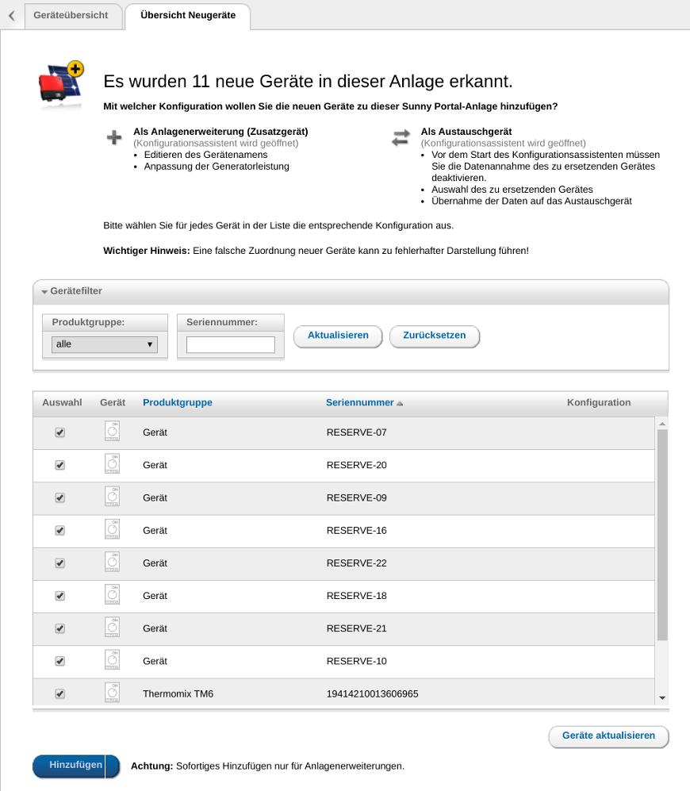
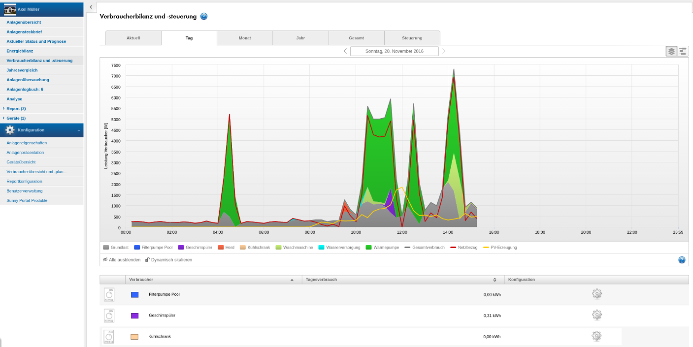
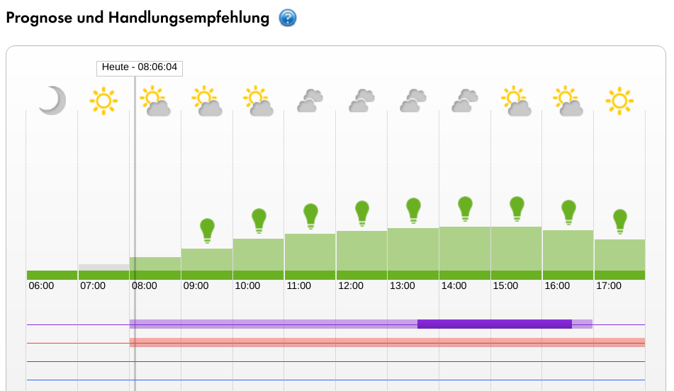

# Sunny Portal

## Hinzugfügen neuer Geräte im Sunny Portal

Bevor der *Sunny Home Manager* ein Gerät steuern oder messen kann, muss dieses im [Sunny Portal](https://www.sunnyportal.com/) hinzugefügt werden.

Dazu muss dort auf der Seite
```
Konfiguration -> Geräteübersicht -> Tab: Übersicht Neugeräte
```
der Button `Geräte aktualisieren` gedrückt werden.

Danach sollte das neue Gerät angezeigt werden:


Durch Drücken des `[+]`-Buttons wird das Gerät hinzugefügt.

Im ersten Schritt kann der Gerätename festgelegt werden - die Vorgabe kommt aus der Konfiguration des Gerätes im *Smart Appliance Enabler*:


Im zweiten Schritt wird lediglich eine Zusammenfassung angezeigt:


Nach Drücken von `Fertigstellen` wird noch eine Bestätigung angezeigt, dass das Gerät hinzugefügt wurde.

Sollte stattdessen die Fehlermeldung angezeigt werden

> Das von Ihrem Sunny Home Manager gefundene Gerät mit der Seriennummer ... ist bereits in einer anderen Anlage registriert und kann deshalb Ihrer Anlage nicht hinzugefügt werden.

ist die von Ihnen für das Gerät gewählte ID bereits vergeben und es muß eine andere [ID konfiguriert](Appliance_DE.md#id) werden. Danach muss man das Gerät im *Sunny Portal*  erneut hinzuzufügen.

### Maximale Anzahl der Geräte im Sunny Portal
<a name="max-devices">

Aktuell unterstützt der Sunny Home Manager *maximal 12 Geräte*. Zur Gesamtzahl zählen neben den Geräten, die mit dem SEMP Protokoll angesprochen werden, auch z.B. SMA Bluetooth Funksteckdosen - also alle Geräte, die im Sunny Portal in der Verbraucherübersicht angezeigt werden. Dieses Limit läßt sich auf 22 anheben, wenn man alle Geräte auf einmal anlegt, solange man weniger als 12 Geräte im *Sunny Portal* anlegt hat. Noch nicht benötige Geräte legt man dann einfach als Platzhalter (Hersteller/Bezeichnung/Seriennummer beliebig, Typ: Sonstige, Max. Leistungsaufnahme: 100 W, ohne Zähler/Schalter) an und ändert einfach die Daten, wenn man tatsächlich ein Gerät anstatt des Platzhalter haben möchte. Wenn man mehr als 12 Geräte im *Sunny Portal*, darf man die Geräte dort nicht inaktiv setzen, da sie sich nicht wieder aktivieren lassen. Stattdessen sollte man nur die Konfiguration im *Smart Appliance Enabler* entsprechend anpassen.

Um die Geräte auf einmal anzulegen, muss man in der `Übersicht Neugeräte`, alle neuen Geräte auswählen und dann den `Hinzufügen`-Button drücken. 

Quelle: https://www.photovoltaikforum.com/thread/104060-ger%C3%A4te-mit-home-manager-koppeln-via-semp-ethernet/?postID=1774797#post1774797



## Vebraucherbilanz

In der *Verbraucherbilanz* sollte ab jetzt das neue Gerät aufgeführt werden mit seinem Verbrauch:



Falls der *Smart Appliance Enabler* für Geräte Timeframes übermittelt werden diese (ca. 10-15 Minuten später) unter *Prognose und Handlungsempfehlung* angezeigt:



Das mögliche Zeitfenster wird dabei durchsichtig angezeigt (im Bild der lilane Balken 8:00 bis 17:00), während die darin geplante Laufzeit nicht durchsichtig ist (im Bild der lila-farbene Balken ca. 13:30 bis 16:30). Im Extremfall ist der komplette Balken tansparent, wenn das Gerät ausschließlich optionale Energie konsumieren möchte (im Bild der orange Balken für eine Wallbox).

## Analyse der Log Dateien des SEMP Moduls im Sunny Home Manager

Siehe https://www.photovoltaikforum.com/thread/104060-ger%C3%A4te-mit-home-manager-koppeln-via-semp-ethernet/?postID=1396300#post1396300

## Fehler "Timeframe for unknown or unrequested device" im Log des SEMP Moduls vom Sunny Home Manager
Der Fehler tritt dann auf wenn sich die interne UID des *Smart Appliance Enabler* ändert. Dies passiert immer dann wenn man die Hardware auf der der *Smart Appliance Enabler* läuft austauscht (zB neuer Raspberry Pi), da sie von der Hardware-MAC-Adresse der ersten Netzwerkstelle abhängt. Einfachste Abhilfe ist ein Neustart des Sunny Home Managers, danach werden die Timeframes wieder akzeptiert.
